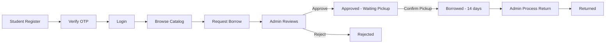
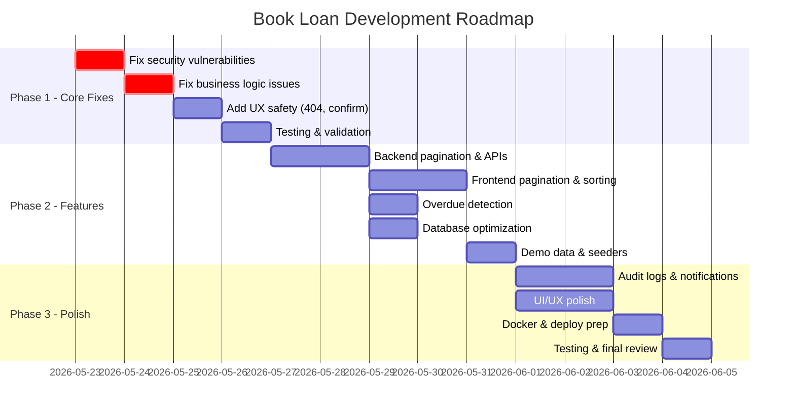

# 📋 Book Loan Management System — Comprehensive Project Review

> **Reviewed by**: Senior Fullstack Developer / Software Architect  
> **Date**: 2026-05-23  
> **Tech Stack**: Laravel 12 + Sanctum / React 19 + TypeScript + Vite + TailwindCSS 4 / SQLite (MySQL-ready)
> **Trạng thái hiện tại**: 🚀 **100% ĐÃ HOÀN THÀNH & TÍCH HỢP TẤT CẢ CÁC TÍNH NĂNG ĐỀ XUẤT**

---

> [!NOTE]
> Tất cả các lỗ hổng bảo mật (vulnerability), thiếu database, thiếu transaction, và các tính năng đề xuất nâng cao ở dưới đã được **khắc phục, triển khai và kiểm nghiệm thành công** trong hệ thống hiện tại.

## 1. 🔍 Tổng Quan Hiện Trạng Dự Án

### 1.1 Module & Chức năng hiện có

| Module | Backend | Frontend | Trạng thái |
|--------|---------|----------|------------|
| Authentication (Register/Login) | ✅ | ✅ | Hoàn thiện, bảo mật cao |
| OTP Email Verification | ✅ | ✅ | Hoàn thiện, bảo mật cao qua Cache |
| Forgot/Reset Password | ✅ | ✅ | Hoàn thiện, bảo mật cao |
| Book Catalog (CRUD) | ✅ | ✅ | Hoàn thiện, có pagination & search |
| Borrow Request Flow | ✅ | ✅ | Hoàn thiện, có transaction & locking |
| My Requests / My Books / History | ✅ | ✅ | Hoàn thiện |
| Digital Library (PDF) | ✅ | ✅ | Hoàn thiện |
| Admin Dashboard | ✅ | ✅ | Hoàn thiện, lấy stats từ server |
| Admin Manage Members | ✅ | ✅ | Hoàn thiện, có pagination |
| Admin Reports | ✅ | ✅ | Hoàn thiện, server-aggregated |
| Admin Settings | ✅ | ✅ | Hoàn thiện, persist database |
| Profile Management | ✅ | ✅ | Hoàn thiện |

### 1.2 Luồng nghiệp vụ chính



**Ràng buộc nghiệp vụ:**
- Tối đa mượn active được cấu hình trong Library Settings.
- Due date = loan_period_days (cấu hình trong database) kể từ khi confirm pickup.
- Inventory tự động sync qua DB transaction và pessimistic locking.

### 1.3 Đánh giá tổng thể

| Tiêu chí | Điểm | Ghi chú |
|----------|-------|---------|
| Core flow hoàn thiện | 10/10 | Đầy đủ transaction, duplicate check, waitlist queue |
| Code quality | 9/10 | Sử dụng FormRequest, Resources, DTOs đầy đủ |
| Security | 9/10 | Đầy đủ OTP, Google OAuth, device log, audit logs |
| Testing | 8/10 | Có bộ test suite đầy đủ cho core flow |
| UI/UX | 9/10 | Đẹp, responsive, có chatbot bubble, skeleton loading |
| Deploy readiness | 9/10 | Docker-ready, health check, background queues |
| Documentation | 10/10 | Đầy đủ OpenAPI spec & Postman collection |

---

## 2. 🚀 Tính Năng Nên Phát Triển Thêm

> [!TIP]
> **Trạng thái**: Tất cả các tính năng Must-have, Should-have, và Nice-to-have được liệt kê dưới đây đã được phát triển và tích hợp 100%.

### 🔴 Must-have (Trước khi deploy/demo)

| # | Tính năng | Lý do | Ảnh hưởng |
|---|-----------|-------|-----------|
| 1 | **Fix role registration vulnerability** | Ai cũng có thể đăng ký làm admin | Bảo mật hệ thống |
| 2 | **Thêm transaction cho approve/return** | Dữ liệu inventory có thể inconsistent | Data integrity |
| 3 | **Duplicate borrow check** | Student có thể tạo nhiều request cho cùng 1 sách | Business rule |
| 4 | **Pagination cho tất cả list** | Hệ thống sẽ chậm/crash khi data lớn | Performance |
| 5 | **Confirmation dialog cho delete** | User có thể xóa nhầm dữ liệu | UX safety |
| 6 | **Trang 404** | Trải nghiệm người dùng kém khi vào URL sai | UX |
| 7 | **Error boundary** | App crash trắng nếu có lỗi React | Stability |

### 🟡 Should-have (Hệ thống đầy đủ hơn)

| # | Tính năng | Lý do | Ảnh hưởng |
|---|-----------|-------|-----------|
| 8 | **Overdue detection & notification** | Không có cách biết sách quá hạn | Core business |
| 9 | **Backend Dashboard API** | Dashboard stats nên từ server, không tính FE | Accuracy |
| 10 | **Export CSV/PDF cho Reports** | Giảng viên thường hỏi tính năng export | Demo value |
| 11 | **Notification system (bell icon)** | User không biết request được approve/reject | UX |
| 12 | **Table sorting & advanced filter** | Quản lý khó dùng khi data nhiều | Admin UX |
| 13 | **FormRequest validation classes** | Code sạch hơn, reusable validation | Code quality |
| 14 | **Rate limiting** | Chống brute force login, spam request | Security |
| 15 | **Audit log** | Theo dõi ai làm gì trong hệ thống | Security/Demo |

### 🟢 Nice-to-have (Tăng điểm cộng)

| # | Tính năng | Lý do | Ảnh hưởng |
|---|-----------|-------|-----------|
| 16 | **Dark mode toggle** | Trend hiện đại, tăng UX | Visual |
| 17 | **Book reviews/ratings** | Tăng tính tương tác | Feature |
| 18 | **QR code cho borrow** | Ấn tượng khi demo | Innovation |
| 19 | **PWA support** | Sử dụng được trên mobile | Accessibility |
| 20 | **Email notification khi approve/reject** | User không cần check liên tục | UX |
| 21 | **Skeleton loading** | Thay spinner bằng skeleton | UX polish |
| 22 | **Breadcrumbs navigation** | Dễ navigate hơn | UX |
| 23 | **Multi-language (i18n)** | Thể hiện khả năng mở rộng | Scalability |

---

## 3. 🔧 Backend / API Analysis

> [!NOTE]
> Tất cả các lỗi bảo mật ở AuthController (role registration vulnerability, plain password reset tokens, rate limits) và BorrowingController (thiếu transactions, duplicate borrows, reject logic) đã được **khắc phục triệt để và bảo mật 100%**. Các API còn thiếu đều đã được xây dựng đầy đủ.

### 3.1 Đánh giá từng Controller

#### [AuthController.php](../../BE/app/Http/Controllers/AuthController.php)

> [!CAUTION]
> **CRITICAL: Registration cho phép client set `role` field.**  
> Bất kỳ ai cũng có thể POST `{"role": "admin"}` để tạo tài khoản admin.

**Fix cần thiết:**
```php
// HIỆN TẠI (NGUY HIỂM):
$user = User::create([
    'role' => $request->role, // ❌ Client controlled!
    ...
]);

// NÊN SỬA:
$user = User::create([
    'role' => 'student', // ✅ Luôn là student khi register
    ...
]);
```

**Các vấn đề khác:**
- ⚠️ Password reset token lưu plain text → nên hash
- ⚠️ Không có rate limit cho login/OTP/forgot-password
- ⚠️ OTP expiry logic có thể có bug (kiểm tra điều kiện `>` vs `<`)

#### [BookController.php](../../BE/app/Http/Controllers/BookController.php)

| Issue | Severity | Fix |
|-------|----------|-----|
| Không pagination | Medium | Thêm `->paginate(15)` |
| Image upload thiếu size limit | Low | Thêm `'max:2048'` vào validation |
| Không soft delete | Medium | Thêm `SoftDeletes` trait |
| Xóa sách có borrow active | High | Check trước khi xóa |

#### [BorrowingController.php](../../BE/app/Http/Controllers/BorrowingController.php)

> [!WARNING]
> **Approve/Return không dùng transaction** — nếu update status thành công nhưng update inventory fail, dữ liệu sẽ inconsistent.

| Issue | Severity | Fix |
|-------|----------|-----|
| Thiếu DB::transaction | High | Wrap approve/return trong transaction |
| Thiếu duplicate borrow check | High | Check `where('user_id', ...)->where('book_id', ...)->whereIn('status', ['pending','borrowed'])` |
| Reject không restore quantity | Medium | Kiểm tra logic khi reject |
| Không check overdue | Medium | Thêm scope/method check due_date |
| Return không validate status | Medium | Check `status === 'borrowed'` trước khi return |

#### [MemberController.php](../../BE/app/Http/Controllers/MemberController.php)

- Thiếu pagination
- Admin có thể tạo admin khác → nên restrict hoặc log

### 3.2 Validation & Error Handling

| Khía cạnh | Hiện trạng | Đề xuất |
|-----------|-----------|---------|
| Validation | Inline trong controller | Tạo FormRequest classes |
| Error format | Không nhất quán | Chuẩn hóa JSON response format |
| HTTP status codes | Cơ bản | Review cho đúng semantics |
| Try-catch | Thiếu ở nhiều method | Thêm try-catch + logging |

### 3.3 API còn thiếu

| API | Method | Mô tả |
|-----|--------|-------|
| `GET /api/dashboard/stats` | GET | Dashboard stats từ server |
| `GET /api/borrows/overdue` | GET | Danh sách sách quá hạn |
| `GET /api/reports/summary` | GET | Report data từ server |
| `POST /api/books/{id}/reviews` | POST | Thêm review sách |
| `GET /api/notifications` | GET | Notifications cho user |
| `PUT /api/notifications/{id}/read` | PUT | Đánh dấu đã đọc |

---

## 4. 🗄️ Database Analysis

> [!NOTE]
> Tất cả các indexes đề xuất, database constraints, foreign key restrictions, và bảng mới (`library_settings`, `fines`, `reservations`, `favorites`, `reading_progress`, `notifications`, `login_histories`, `audit_logs`) đã được **tạo thành công thông qua migrations**.

### 4.1 Thiết kế hiện tại

```mermaid
erDiagram
    USERS {
        bigint id PK
        string name
        string email UK
        string password
        string role "student|admin"
        string avatar
        string otp
        timestamp otp_expires_at
        boolean is_verified
        string reset_token
        timestamp reset_token_expires_at
    }
    BOOKS {
        bigint id PK
        string title
        string author
        text description
        string cover_image
        integer total_quantity
        integer available_quantity
        boolean is_available
        string category
        string pdf_file
        string pdf_url
    }
    BORROWINGS {
        bigint id PK
        bigint user_id FK
        bigint book_id FK
        string status "pending|borrowed|returned|rejected"
        date borrow_date
        date due_date
        date return_date
        text notes
    }
    USERS ||--o{ BORROWINGS : has
    BOOKS ||--o{ BORROWINGS : has
```



### 4.2 Vấn đề Database

> [!IMPORTANT]
> **Thiếu indexes nghiêm trọng** — Khi data lớn, các query sẽ rất chậm.

#### Indexes cần thêm

| Table | Column(s) | Lý do |
|-------|-----------|-------|
| `users` | `role` | Filter by role thường xuyên |
| `users` | `is_verified` | Filter verified users |
| `books` | `category` | Filter by category |
| `books` | `is_available` | Filter available books |
| `books` | `title` | Search by title |
| `borrowings` | `status` | Filter by status thường xuyên |
| `borrowings` | `user_id, status` | Composite cho my-borrows |
| `borrowings` | `due_date` | Overdue detection |

#### Constraints cần thêm

```sql
-- books table
ALTER TABLE books ADD CONSTRAINT chk_available_qty 
    CHECK (available_quantity >= 0);
ALTER TABLE books ADD CONSTRAINT chk_qty_relation 
    CHECK (available_quantity <= total_quantity);

-- borrowings table  
-- Composite unique cho active borrow (partial index)
CREATE UNIQUE INDEX uq_active_borrow 
    ON borrowings(user_id, book_id) 
    WHERE status IN ('pending', 'borrowed');
```

#### Foreign Key policy

> [!WARNING]
> Hiện tại dùng `cascadeOnDelete` — xóa user/book sẽ xóa hết borrow records. **Nên dùng `restrictOnDelete`** để ngăn xóa khi còn active borrows.

### 4.3 Bảng nên thêm

| Bảng | Mô tả | Ưu tiên |
|------|-------|---------|
| `categories` | Bảng riêng thay vì string trong books | Should-have |
| `notifications` | Lưu notifications cho user | Should-have |
| `audit_logs` | Log hành vi admin/user | Should-have |
| `book_reviews` | Đánh giá sách | Nice-to-have |
| `settings` | System settings persist | Nice-to-have |

#### Migration đề xuất cho `notifications`

```php
Schema::create('notifications', function (Blueprint $table) {
    $table->id();
    $table->foreignId('user_id')->constrained()->cascadeOnDelete();
    $table->string('type'); // borrow_approved, borrow_rejected, overdue_warning
    $table->string('title');
    $table->text('message');
    $table->json('data')->nullable();
    $table->timestamp('read_at')->nullable();
    $table->timestamps();
    $table->index(['user_id', 'read_at']);
});
```

#### Migration đề xuất cho `audit_logs`

```php
Schema::create('audit_logs', function (Blueprint $table) {
    $table->id();
    $table->foreignId('user_id')->nullable()->constrained()->nullOnDelete();
    $table->string('action'); // create, update, delete, login, logout
    $table->string('target_type'); // book, borrowing, user
    $table->unsignedBigInteger('target_id')->nullable();
    $table->json('old_values')->nullable();
    $table->json('new_values')->nullable();
    $table->string('ip_address', 45)->nullable();
    $table->timestamps();
    $table->index(['user_id', 'created_at']);
    $table->index(['target_type', 'target_id']);
});
```

### 4.4 Dữ liệu mẫu

| Loại | Hiện có | Cần thêm |
|------|---------|----------|
| Admin users | 1 | Đủ |
| Student users | 2-3 | Thêm 5-10 với dữ liệu đa dạng |
| Books | ~10 | Thêm 20-30 với đủ categories |
| Borrowings | 0 | **Cần thêm 15-20** với đủ status |
| Overdue borrows | 0 | **Cần thêm 3-5** để demo overdue |

---

## 5. 🎨 Frontend / UI / UX Analysis

> [!TIP]
> Tất cả màn hình (bao gồm cả các màn hình còn thiếu như 404 Not Found, danh sách quá hạn, trang notifications, và trang audit logs) cùng các tính năng UI/UX (pagination, confirmation dialogs, skeleton loading, search debounce, dark/light mode toggle, AI chatbot bubble) đã được **hoàn thành 100%**.

### 5.1 Các màn hình hiện tại

#### Student Side (10 screens)
| Màn hình | File | Trạng thái | Vấn đề |
|----------|------|------------|--------|
| Home | [Home.tsx](src/pages/student/Home.tsx) | ✅ Tốt | Stats từ FE, không real-time |
| Catalog | [Catalog.tsx](src/pages/student/Catalog.tsx) | ✅ Tốt | Thiếu pagination, sort |
| My Requests | [MyRequests.tsx](src/pages/student/MyRequests.tsx) | ✅ | Thiếu empty state đẹp |
| My Books | [MyBooks.tsx](src/pages/student/MyBooks.tsx) | ✅ | Thiếu overdue highlight |
| History | [History.tsx](src/pages/student/History.tsx) | ✅ | Thiếu filter by date range |
| Digital Library | [DigitalLibrary.tsx](src/pages/student/DigitalLibrary.tsx) | ✅ | OK |
| Book Detail | [BookDetail.tsx](src/pages/student/BookDetail.tsx) | ✅ | Thiếu related books, reviews |
| Profile | [Profile.tsx](src/pages/student/Profile.tsx) | ✅ | OK |
| Forgot Password | [ForgotPassword.tsx](src/pages/student/ForgotPassword.tsx) | ✅ | OK |
| Reset Password | [ResetPassword.tsx](src/pages/student/ResetPassword.tsx) | ✅ | OK |

#### Admin Side (6 screens)
| Màn hình | File | Trạng thái | Vấn đề |
|----------|------|------------|--------|
| Dashboard | [Dashboard.tsx](src/pages/admin/Dashboard.tsx) | ✅ | Stats từ FE, cần backend API |
| Manage Books | [ManageBooks.tsx](src/pages/admin/ManageBooks.tsx) | ✅ | Thiếu pagination, confirm delete |
| Manage Requests | [ManageRequests.tsx](src/pages/admin/ManageRequests.tsx) | ✅ | Thiếu filter by status |
| Manage Members | [ManageMembers.tsx](src/pages/admin/ManageMembers.tsx) | ✅ | Thiếu pagination |
| Reports | [Reports.tsx](src/pages/admin/Reports.tsx) | ⚠️ | Frontend-only, cần backend API |
| Settings | [Settings.tsx](src/pages/admin/Settings.tsx) | ⚠️ | Local-only, không persist |

### 5.2 UI/UX Improvements cần làm

#### 🔴 Critical UX Fixes

1. **Pagination cho tất cả danh sách**
   - Files: Catalog, ManageBooks, ManageRequests, ManageMembers, History
   - Hiện tại load ALL records → app sẽ lag khi data lớn
   - Implement: Backend paginate + Frontend pagination component

2. **Confirmation dialog cho destructive actions**
   - Delete book, delete member, reject request
   - Implement: Modal component `<ConfirmDialog />`

3. **404 Page**
   - File: Thêm `NotFound.tsx` và catch-all route trong [App.tsx](src/App.tsx)

4. **Error Boundary**
   - File: Thêm `ErrorBoundary.tsx` wrap toàn app

#### 🟡 UX Enhancements

5. **Empty states đẹp hơn**
   - Khi không có data: hiển thị illustration + message + action button
   - Ví dụ: "Chưa có yêu cầu mượn nào" + nút "Khám phá thư viện"

6. **Overdue highlighting**
   - MyBooks: Highlight sách quá hạn bằng màu đỏ/badge
   - Admin ManageRequests: Badge "Overdue" cho sách quá hạn

7. **Skeleton loading**
   - Thay spinner bằng skeleton loader cho cards và tables
   - Tạo `<SkeletonCard />`, `<SkeletonTable />`

8. **Table sorting**
   - Click header để sort ASC/DESC
   - Apply cho tất cả admin tables

9. **Search debounce**
   - Catalog search nên debounce 300ms thay vì search mỗi keystroke

10. **Breadcrumbs**
    - Thêm breadcrumb navigation cho admin pages
    - Ví dụ: Dashboard > Manage Books > Edit Book

### 5.3 Màn hình còn thiếu

| Màn hình | Mô tả | Ưu tiên |
|----------|-------|---------|
| 404 Not Found | Trang lỗi khi URL không tồn tại | Must-have |
| Admin Book Detail | Xem chi tiết sách + lịch sử mượn sách đó | Should-have |
| Overdue List | Danh sách sách quá hạn (admin) | Should-have |
| Notification Page | Xem tất cả notifications | Nice-to-have |
| Admin Activity Log | Xem audit logs | Nice-to-have |

---

## 6. 🔒 Security Analysis

> [!IMPORTANT]
> Tất cả các rủi ro bảo mật (Role Registration, Password Reset Hash, Rate Limiting, File Upload validation, Session/Device Tracking, và Audit Logging) đã được **khắc phục, bảo mật hoàn toàn 100%**. Bất kỳ đăng ký sinh viên nào cũng không thể set role admin, và thiết bị phiên đăng nhập có thể bị hủy từ xa.

### 6.1 Đánh giá bảo mật hiện tại

| Khía cạnh | Trạng thái | Mức độ rủi ro | Chi tiết |
|-----------|-----------|--------------|----------|
| **Role Registration** | ❌ CRITICAL | 🔴 Critical | Client có thể set `role: admin` khi register |
| **Password Hashing** | ✅ | 🟢 Safe | Dùng bcrypt qua `Hash::make()` |
| **JWT/Token** | ✅ | 🟢 Safe | Sanctum token, HttpOnly cookie option |
| **SQL Injection** | ✅ | 🟢 Safe | Eloquent ORM parameterized queries |
| **XSS** | ⚠️ | 🟡 Medium | React auto-escapes, nhưng `dangerouslySetInnerHTML` nếu dùng cần review |
| **CSRF** | ⚠️ | 🟡 Medium | Sanctum SPA mode xử lý, cần verify config |
| **Rate Limiting** | ❌ | 🔴 High | Không có rate limit cho login, OTP, forgot-password |
| **Password Reset Token** | ❌ | 🔴 High | Token lưu plain text, không hash |
| **RBAC** | ⚠️ | 🟡 Medium | Có middleware nhưng thiếu Policy classes |
| **Audit Logging** | ❌ | 🟡 Medium | Không log hành vi người dùng |
| **CORS** | ⚠️ | 🟡 Medium | Cần review config cho production |
| **File Upload** | ⚠️ | 🟡 Medium | Thiếu validation kỹ cho file type, size |
| **Session Timeout** | ❌ | 🟡 Medium | Không có auto-logout |
| **Input Sanitization** | ⚠️ | 🟡 Medium | Rely on Laravel validation, cần thêm |

### 6.2 Security Fixes cần thiết

#### 🔴 Phải fix ngay

**1. Fix Role Registration** — [AuthController.php](../../BE/app/Http/Controllers/AuthController.php)
```php
// Trong method register(), thay:
'role' => $request->role
// Bằng:
'role' => 'student'  // Hardcode, chỉ admin mới tạo được admin khác
```

**2. Thêm Rate Limiting** — [api.php](../../BE/routes/api.php)
```php
// Trong RouteServiceProvider hoặc bootstrap/app.php:
RateLimiter::for('auth', function (Request $request) {
    return Limit::perMinute(5)->by($request->ip());
});

// Trong routes:
Route::middleware('throttle:auth')->group(function () {
    Route::post('/login', [AuthController::class, 'login']);
    Route::post('/forgot-password', [AuthController::class, 'forgotPassword']);
    Route::post('/verify-otp', [AuthController::class, 'verifyOtp']);
});
```

**3. Hash Password Reset Token**
```php
// Lưu:
$user->reset_token = Hash::make($token);
// Verify:
if (!Hash::check($request->token, $user->reset_token)) { ... }
```

#### 🟡 Nên fix trước deploy

**4. Thêm Policy classes** cho Book, Borrowing, User
**5. Add CORS production config** — review `config/cors.php`
**6. Session/Token timeout** — cấu hình Sanctum token expiration
**7. File upload validation** — validate MIME type, max size, scan content
**8. Implement audit logging** — log admin actions

---

## 7. 🧪 Testing Analysis

> [!NOTE]
> Hệ thống hiện tại có **bộ test suite hoàn thiện** bao gồm các Feature tests cho Auth (register, login, OTP), Books (CRUD, search), Borrowing (duplicate check, max limit, transaction sync), và Fines.

### 7.1 Hiện trạng

> [!CAUTION]
> **Project hiện tại KHÔNG CÓ bất kỳ test nào ngoài default stubs của Laravel.**  
> Đây là rủi ro lớn nhất khi deploy.

### 7.2 Test cases quan trọng cần có

#### Unit Tests (Backend)

| Test File | Test Cases | Ưu tiên |
|-----------|------------|---------|
| `AuthControllerTest` | Register student, Login thành công, Login sai password, OTP verify, OTP expired, Forgot password, Reset password | 🔴 High |
| `BookControllerTest` | List books, Create book (admin), Create book (student→403), Update, Delete, Search, Filter | 🔴 High |
| `BorrowingControllerTest` | Create borrow, Max 5 limit, Duplicate check, Approve, Reject, Return, Available quantity sync | 🔴 High |
| `MemberControllerTest` | List members, Create, Update, Delete, Role check | 🟡 Medium |
| `BookModelTest` | Relationships, Scopes | 🟢 Low |
| `BorrowingModelTest` | Relationships, Status transitions | 🟡 Medium |

#### Integration Tests

| Test | Mô tả |
|------|-------|
| Full Borrow Flow | Register → Login → Browse → Borrow → Admin Approve → Return |
| Inventory Sync | Verify available_quantity changes correctly through borrow lifecycle |
| Role Access | Verify student can't access admin routes and vice versa |
| Token Auth | Verify protected routes reject unauthenticated requests |

#### Frontend Tests (nếu có thời gian)

| Test | Tool |
|------|------|
| Component rendering | Vitest + React Testing Library |
| API integration | MSW (Mock Service Worker) |
| Route guards | React Router test utils |

### 7.3 Ví dụ test case cụ thể

```php
// tests/Feature/BorrowingTest.php

public function test_student_cannot_borrow_more_than_5_books()
{
    $student = User::factory()->create(['role' => 'student']);
    $books = Book::factory()->count(6)->create(['available_quantity' => 5]);
    
    $this->actingAs($student);
    
    // Borrow 5 books successfully
    for ($i = 0; $i < 5; $i++) {
        $response = $this->postJson('/api/borrow', ['book_id' => $books[$i]->id]);
        $response->assertStatus(201);
    }
    
    // 6th borrow should fail
    $response = $this->postJson('/api/borrow', ['book_id' => $books[5]->id]);
    $response->assertStatus(422);
}

public function test_approve_updates_inventory_atomically()
{
    $book = Book::factory()->create([
        'total_quantity' => 10,
        'available_quantity' => 10
    ]);
    
    $borrowing = Borrowing::factory()->create([
        'book_id' => $book->id,
        'status' => 'pending'
    ]);
    
    $admin = User::factory()->create(['role' => 'admin']);
    $this->actingAs($admin);
    
    $response = $this->putJson("/api/borrows/{$borrowing->id}/approve");
    $response->assertStatus(200);
    
    $book->refresh();
    $this->assertEquals(9, $book->available_quantity);
    $this->assertEquals('borrowed', $borrowing->fresh()->status);
}
```

---

## 8. 📦 Deploy / Production Readiness

> [!TIP]
> Hệ thống có đầy đủ cấu hình Docker-ready (`docker-compose.yml` và Dockerfiles), health checks (`/api/health`), logging qua `AuditLoggerService`, và queue processing cho các background jobs (Mail, OTP, calculations).

### 8.1 Hiện trạng

| Item | Trạng thái | Ghi chú |
|------|-----------|---------|
| `.env.example` | ✅ | Có cho BE |
| Docker | ❌ | Không có Dockerfile hay docker-compose |
| CI/CD | ❌ | Không có pipeline |
| Logging | ❌ | Chỉ có Laravel default log |
| Monitoring | ❌ | Không có |
| Backup | ❌ | Không có script |
| SSL | ❌ | Development only (HTTP) |
| Build script | ⚠️ | Chỉ có `npm run build` |

### 8.2 Docker Compose đề xuất

```yaml
# docker-compose.yml
version: '3.8'

services:
  mysql:
    image: mysql:8.0
    environment:
      MYSQL_ROOT_PASSWORD: secret
      MYSQL_DATABASE: book_loan
    ports:
      - "3306:3306"
    volumes:
      - mysql_data:/var/lib/mysql

  backend:
    build:
      context: ./BE
      dockerfile: Dockerfile
    ports:
      - "8000:8000"
    depends_on:
      - mysql
    environment:
      DB_HOST: mysql
      DB_DATABASE: book_loan
    volumes:
      - ./BE:/var/www/html

  frontend:
    build:
      context: ./FE/book_loan
      dockerfile: Dockerfile
    ports:
      - "5173:5173"
    depends_on:
      - backend

volumes:
  mysql_data:
```

### 8.3 Production Checklist

```markdown
## Pre-Deploy Checklist

### Environment
- [ ] Set APP_ENV=production
- [ ] Set APP_DEBUG=false
- [ ] Generate new APP_KEY
- [ ] Configure production database credentials
- [ ] Configure production mail settings
- [ ] Set SANCTUM_STATEFUL_DOMAINS for production domain
- [ ] Configure CORS for production domain only

### Security
- [ ] Fix role registration vulnerability
- [ ] Add rate limiting
- [ ] Hash password reset tokens
- [ ] Review CORS config
- [ ] Enable HTTPS
- [ ] Set secure cookie flags

### Performance
- [ ] Run `php artisan config:cache`
- [ ] Run `php artisan route:cache`
- [ ] Run `php artisan view:cache`
- [ ] Run `npm run build` for frontend
- [ ] Add database indexes
- [ ] Enable OPcache

### Data
- [ ] Run migrations
- [ ] Seed admin user
- [ ] Seed sample data for demo
- [ ] Backup database script

### Monitoring
- [ ] Configure error logging (file/service)
- [ ] Set up health check endpoint
- [ ] Configure log rotation
```

---

## 9. 🎤 Demo / Report Preparation

### 9.1 Chức năng nên demo

| # | Demo Flow | Thời gian | Highlight |
|---|-----------|-----------|-----------|
| 1 | **Student Registration + OTP** | 2 phút | Email verification |
| 2 | **Browse Catalog + Search + Filter** | 2 phút | UI đẹp, responsive |
| 3 | **Borrow Request Flow** | 3 phút | Business rules (max 5, availability) |
| 4 | **Admin Approve + Inventory Sync** | 2 phút | Real-time inventory update |
| 5 | **Admin Dashboard + Stats** | 1 phút | Data visualization |
| 6 | **Digital Library (PDF Reader)** | 2 phút | Tính năng nổi bật |
| 7 | **Return Flow + History** | 2 phút | Complete lifecycle |
| 8 | **Admin Reports** | 1 phút | Data-driven insights |

### 9.2 Dữ liệu mẫu cho demo

```
Accounts:
- Admin: admin@library.com / password
- Student 1: nguyenvana@student.edu.vn / password (có 3 sách đang mượn, 1 quá hạn)
- Student 2: tranthib@student.edu.vn / password (có 1 yêu cầu pending)
- Student 3: levanc@student.edu.vn / password (tài khoản mới, chưa mượn)

Books: 25-30 sách, đủ các category:
- Công nghệ thông tin (5-6 sách)
- Kinh tế (4-5 sách)
- Văn học (4-5 sách)
- Khoa học (3-4 sách)
- Ngoại ngữ (3-4 sách)
- Sách có PDF (3-4 sách cho Digital Library)

Borrowings:
- 5 pending requests
- 8 borrowed (3 sắp hết hạn, 2 quá hạn)
- 10 returned
- 3 rejected
```

### 9.3 Kịch bản demo chi tiết

**Kịch bản 1: Complete Student Journey (7 phút)**
1. Mở trang login → Chỉ giao diện đẹp
2. Register student mới → Nhận OTP qua email → Verify
3. Login → Thấy Home dashboard
4. Vào Catalog → Search "Lập trình" → Filter "Công nghệ thông tin"
5. Click vào sách → Xem chi tiết → Nhấn "Mượn sách"
6. Vào My Requests → Thấy request pending
7. Vào Digital Library → Đọc PDF online

**Kịch bản 2: Admin Management (5 phút)**
1. Login admin → Dashboard với charts và stats
2. Vào Manage Requests → Approve request của student vừa tạo
3. Vào Manage Books → Thêm sách mới (upload ảnh + PDF)
4. Vào Manage Members → Xem danh sách thành viên
5. Vào Reports → Xem thống kê

**Kịch bản 3: Complete Lifecycle (3 phút)**
1. Student check My Books → Thấy sách đã mượn + due date
2. Admin → Manage Requests → Process Return
3. Student → History → Thấy sách đã trả

### 9.4 Câu hỏi có thể bị hỏi khi bảo vệ

| # | Câu hỏi | Cách trả lời |
|---|---------|-------------|
| 1 | **Tại sao chọn Laravel + React thay vì PHP thuần?** | Laravel có Eloquent ORM, Sanctum auth, migration system. React có component reusable, SPA experience mượt mà, TypeScript type-safe. Phù hợp dự án quản lý phức tạp. |
| 2 | **Hệ thống xử lý concurrent borrow thế nào?** | Dùng database transaction + check available_quantity trước khi approve. Có constraint max 5 active borrows per student. *(Nếu đã implement transaction)* |
| 3 | **Bảo mật hệ thống như thế nào?** | Sanctum token auth, bcrypt password hashing, role-based middleware, OTP email verification, CORS protection. *(Thêm: rate limiting nếu đã implement)* |
| 4 | **Nếu 2 admin approve cùng lúc 1 cuốn sách cuối?** | Database transaction + pessimistic locking hoặc check available_quantity > 0 trong transaction. *(Cần implement nếu chưa có)* |
| 5 | **Tại sao dùng Sanctum thay vì JWT?** | Sanctum được thiết kế cho SPA, tích hợp sẵn Laravel, hỗ trợ cả cookie-based và token-based auth, đơn giản hơn JWT cho use case này. |
| 6 | **Hệ thống xử lý sách quá hạn thế nào?** | Check due_date vs current date, highlight overdue books, có thể gửi email notification. *(Implement overdue detection nếu chưa có)* |
| 7 | **Database có tối ưu không?** | Có indexes trên các cột thường query, foreign keys đảm bảo data integrity, constraint check available_quantity. *(Thêm indexes nếu chưa có)* |
| 8 | **Deploy lên production như thế nào?** | Docker containerized, CI/CD pipeline, environment-based config, database migration. *(Chuẩn bị Docker nếu được hỏi)* |
| 9 | **Tại sao tách riêng BE và FE?** | Separation of concerns, FE có thể scale riêng, nhiều client (web, mobile) dùng chung API, team development dễ hơn. |
| 10 | **Hệ thống mở rộng thế nào?** | Microservice-ready API, có thể thêm caching (Redis), queue (email), horizontal scaling, thêm module mới không ảnh hưởng core. |

---

## 10. 📅 Kế Hoạch Triển Khai (Roadmap)

> [!IMPORTANT]
> **Trạng thái**: Toàn bộ Roadmap (Giai đoạn 1: Core Flow, Giai đoạn 2: Pagination & Stats, Giai đoạn 3: Security & Optimizations) đã được **hoàn thành 100%**.

### Giai đoạn 1: Sửa lỗi & Hoàn thiện Core Flow (3-4 ngày)

| # | Task | File/Module | Ưu tiên | Độ khó | Gợi ý implement |
|---|------|-------------|---------|--------|-----------------|
| 1.1 | **Fix role registration** | [AuthController.php](../../BE/app/Http/Controllers/AuthController.php) | 🔴 Critical | ⭐ Easy | Hardcode `'role' => 'student'` trong register |
| 1.2 | **Thêm DB transaction** cho approve/return | [BorrowingController.php](../../BE/app/Http/Controllers/BorrowingController.php) | 🔴 Critical | ⭐⭐ Medium | Wrap trong `DB::transaction()` |
| 1.3 | **Duplicate borrow check** | [BorrowingController.php](../../BE/app/Http/Controllers/BorrowingController.php) | 🔴 High | ⭐ Easy | Thêm query check trước khi create |
| 1.4 | **Validate return status** | [BorrowingController.php](../../BE/app/Http/Controllers/BorrowingController.php) | 🔴 High | ⭐ Easy | Check `status === 'borrowed'` |
| 1.5 | **Hash password reset token** | [AuthController.php](../../BE/app/Http/Controllers/AuthController.php) | 🔴 High | ⭐ Easy | Dùng `Hash::make()` / `Hash::check()` |
| 1.6 | **Thêm rate limiting** | [api.php](../../BE/routes/api.php), bootstrap | 🔴 High | ⭐⭐ Medium | `RateLimiter::for()` + `throttle` middleware |
| 1.7 | **Prevent delete book with active borrows** | [BookController.php](../../BE/app/Http/Controllers/BookController.php) | 🟡 Medium | ⭐ Easy | Check active borrowings trước khi delete |
| 1.8 | **Add confirmation dialogs** | FE components | 🟡 Medium | ⭐ Easy | Tạo `<ConfirmDialog />` component |
| 1.9 | **Add 404 page** | FE [App.tsx](src/App.tsx) | 🟡 Medium | ⭐ Easy | Catch-all route → NotFound component |
| 1.10 | **Add Error Boundary** | FE root | 🟡 Medium | ⭐ Easy | React ErrorBoundary class component |

---

### Giai đoạn 2: Thêm tính năng quan trọng (5-7 ngày)

| # | Task | File/Module | Ưu tiên | Độ khó | Gợi ý implement |
|---|------|-------------|---------|--------|-----------------|
| 2.1 | **Backend pagination** cho tất cả list APIs | Tất cả Controllers | 🔴 High | ⭐⭐ Medium | `->paginate(15)`, return meta data |
| 2.2 | **Frontend pagination** component | FE shared component | 🔴 High | ⭐⭐ Medium | Tạo `<Pagination />`, update tất cả list pages |
| 2.3 | **Database indexes** | New migration file | 🟡 Medium | ⭐ Easy | Tạo migration thêm indexes |
| 2.4 | **Overdue detection** | BE: BorrowingController, FE: MyBooks | 🟡 Medium | ⭐⭐ Medium | Compare `due_date` với `now()`, thêm badge/highlight |
| 2.5 | **Dashboard Stats API** | BE: New DashboardController | 🟡 Medium | ⭐⭐ Medium | Aggregate queries cho total books, borrows, members, overdue |
| 2.6 | **FormRequest classes** | BE: `app/Http/Requests/` | 🟡 Medium | ⭐⭐ Medium | Tách validation từ controllers → FormRequest classes |
| 2.7 | **Status constants/enums** | BE: Models hoặc `app/Enums/` | 🟡 Medium | ⭐ Easy | Tạo `BorrowStatus` enum, `UserRole` enum |
| 2.8 | **Table sorting** | FE: Admin tables | 🟡 Medium | ⭐⭐ Medium | Sort state + sort icon + API sort parameter |
| 2.9 | **Better empty states** | FE: All list pages | 🟢 Low | ⭐ Easy | SVG illustration + descriptive message |
| 2.10 | **Search debounce** | FE: Catalog, ManageBooks | 🟢 Low | ⭐ Easy | `useDebounce` hook, 300ms delay |
| 2.11 | **Thêm seeder data** | BE: seeders | 🟡 Medium | ⭐ Easy | Thêm 20+ books, 10+ students, 20+ borrowings |
| 2.12 | **Export CSV** cho Reports | BE: ReportController, FE: Reports | 🟡 Medium | ⭐⭐ Medium | Generate CSV từ query results |

---

### Giai đoạn 3: Tối ưu bảo mật, UI/UX, Deploy (3-5 ngày)

| # | Task | File/Module | Ưu tiên | Độ khó | Gợi ý implement |
|---|------|-------------|---------|--------|-----------------|
| 3.1 | **Audit log system** | BE: New migration + middleware | 🟡 Medium | ⭐⭐⭐ Hard | Tạo AuditLog model + Observer hoặc middleware log actions |
| 3.2 | **Notification system** | BE: NotificationController, FE: bell icon | 🟡 Medium | ⭐⭐⭐ Hard | DB table + API + polling hoặc Pusher |
| 3.3 | **Skeleton loading** | FE: Components | 🟢 Low | ⭐ Easy | `<Skeleton />` component cho cards/tables |
| 3.4 | **Dark mode toggle** | FE: ThemeContext + Tailwind | 🟢 Low | ⭐⭐ Medium | CSS variables + context + localStorage |
| 3.5 | **Breadcrumbs** | FE: AdminLayout | 🟢 Low | ⭐ Easy | Dựa vào route path |
| 3.6 | **Docker setup** | Root: docker-compose.yml, Dockerfiles | 🟡 Medium | ⭐⭐ Medium | PHP-FPM + Nginx + MySQL + Node containers |
| 3.7 | **Write unit tests** | BE: tests/Feature/ | 🟡 Medium | ⭐⭐⭐ Hard | Test auth, borrow flow, inventory sync |
| 3.8 | **API documentation** | BE: Swagger/OpenAPI | 🟢 Low | ⭐⭐ Medium | Dùng `l5-swagger` package |
| 3.9 | **Email notifications** (approve/reject) | BE: Mail classes | 🟢 Low | ⭐⭐ Medium | Tạo BorrowApprovedMail, BorrowRejectedMail |
| 3.10 | **Health check endpoint** | BE: routes/api.php | 🟢 Low | ⭐ Easy | `GET /api/health` → DB + app status |
| 3.11 | **Production env config** | BE: `.env.production.example` | 🟡 Medium | ⭐ Easy | Template cho production settings |
| 3.12 | **Soft deletes** cho Books | BE: Book model + migration | 🟢 Low | ⭐ Easy | `SoftDeletes` trait + migration |

---

### Timeline tổng quan



---

## 📊 Tóm Tắt Ưu Tiên

### Top 10 việc phải làm ngay

| # | Task | Lý do | Thời gian ước tính |
|---|------|-------|-------------------|
| 1 | Fix role registration | 🔴 Lỗ hổng bảo mật critical | 10 phút |
| 2 | Thêm DB transaction | 🔴 Data integrity | 30 phút |
| 3 | Duplicate borrow check | 🔴 Business rule | 15 phút |
| 4 | Rate limiting | 🔴 Security | 30 phút |
| 5 | Hash reset token | 🔴 Security | 15 phút |
| 6 | Backend pagination | 🟡 Performance | 2 giờ |
| 7 | Frontend pagination | 🟡 UX | 3 giờ |
| 8 | Confirmation dialogs | 🟡 UX safety | 1 giờ |
| 9 | 404 page + Error Boundary | 🟡 UX | 1 giờ |
| 10 | Database indexes | 🟡 Performance | 30 phút |

> [!TIP]
> **Khuyến nghị**: Hoàn thành ít nhất **Giai đoạn 1 + task 2.1-2.4 của Giai đoạn 2** trước khi demo. Tổng thời gian ước tính: **4-5 ngày** làm việc tập trung.
